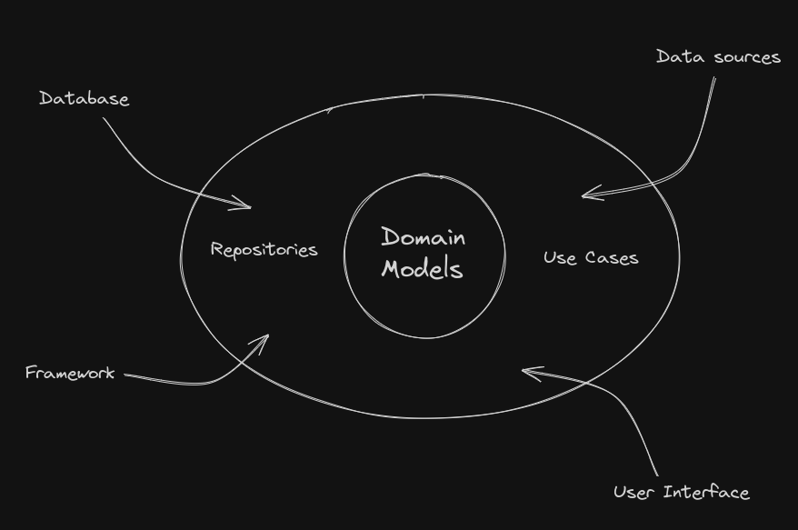

# Application Structure
In this section we go over the **project folder structure** and the general application architecture.

Choices made here are opinionated, as is the implementation behind the theoretical concepts of 
different architectures/tech stacks/whatever(s).

They might not be the most optimal or industry standard, but they have been chosen because they work 
or the authors know how to work with them. 

## Architecture
Overall, the application takes a mix of a layered and 'clean' architecture decisions, with some domain
driven design.

In a general overview, there are 4 layers:
- data
- domain
- ui(presentation)
- framework

Visually, it looks something like this:


The architecture design is flexible, and it tries to establish patterns to handle things like:

- Separation of Concerns: A local `Dao` is only concerned with handling CRUD operations on its 
related entity. It does not concern itself with that entity's relations to others in the system. 
The layer is also not concerned about how its data is process downstream, or displayed in the UI.
- Encapsulation of Logic: Use Cases are created where they make sense, a piece of complex logic or
logic that will be used in multiple places. It is hidden behind an interface contract to enforce
a signature and allow implementation swapping. 

These are of course just examples for the terms.
Ideas behind each layer are explained in more detail below.


### Data Layer
Responsible for handling local and remote data sources. Structures responsible for representing
data in this layer are `Entities` and `Relations`. These are value objects, and their respective `Daos`
(or in some cases `DataSource`) objects are service objects responsible for mostly CRUD operations 
and mapping. 

Read more [here](https://publicobject.com/2019/06/10/value-objects-service-objects-and-glue/).

For local data sources(specifically in our case the Room wrapper around an SQLite database), we have
`Entity` classes representing the rows/columns managed by the database. In this case, we don't need
additional mapping in this layer, as the data does not go out to an external source.

Example: `ExtractionEntity`, `ImageEmbeddingsRelation`, `ExtractionDao`.

A note on classes representing relationships. You might have noticed that the database APIs are slightly
different compared to the standard `javax.persistence` APIs. 
In JPA, usually database relationships are modelled directly in the entity classes(Object relational Mapping).

Whilst this brings conveniences and an (subjectively) easier mental model, there are a few issues with this approach:
- Object references: The classic circular trap with one-to-many relationships.
An `Author` has many `Book`s(a list of them), and each `Book` has one `Author`. So, we fetch an author and his books,
and each book has the same author, who has the same list etc etc. In cases where serialization is used
this problem can usually be ignored, but it creates a data model that is not actually representative of
the underlying schema. 
- Lazy loading: Read in detail [here](https://developer.android.com/training/data-storage/room/referencing-data#understand-no-object-references)

So, for this application we use intermediate data classes to define and model explicitly the relationships
between objects. Whilst this means we have to do more work to handle our data(there are no cascading effects) 
it also means we are explicit in our code and intentions.

Take a look at `ImageEmbeddingRelation` and above link for more info.

For remote data sources, as mentioned above, we might have `Entity` and `Dto` objects representing
the what the data layer is concerned about versus the data coming in from the external source. Mappings
may be present here.

There are currently no remote data sources in the application.

In cases where necessary, `Dao`s can be composite -> they can take other `Dao`s as dependencies
to encapsulate service operations on related objects.

Example:
```kotlin
class CompositeDaoImpl(
    private val firstDao: FirstDao,
    private val secondDao: SecondDao
): CompositeDao {
    suspend fun foo(){
        firstDao.one()
        //...
        secondDao.two()
    }
}
```

### Domain Layer